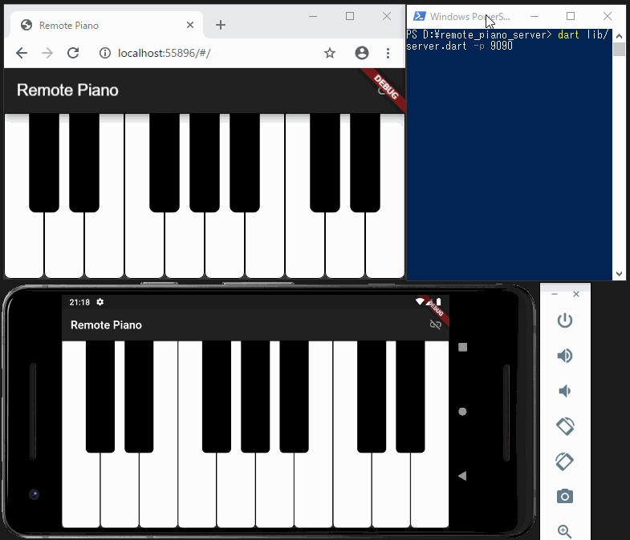

# Remote Piano

A toy piano app made with Flutter as a gRPC example, with a unique feature to interact with remote devices.

## Demo

https://kaboc.github.io/flutter_remote_piano/

See the information on web limitations below.

## Supported platforms

* Android
* iOS
* Web (limited)
    * `gRPC-Web` is used for web instead of `grpc-dart`.
    * Sending notes is not supported due to the limited functionality of gRPC-Web.
    * Receiving notes does not start unless you send a request by tapping any one of keys after connected to a server.
    * Tapping more keys cause an error printed in a browser console.
    * A gateway proxy is necessary between a server and clients.
        * See the README of [piano_server](https://github.com/kaboc/piano_server) for details.

**No sound font (.sf2) file is in this repository.**
Search and get one, and place it in `/assets/sf2/` before you run the app. 

## Server

Either of the servers below is necessary if you use the remote operation feature of the app.

* [Server in Dart](https://github.com/kaboc/piano_server)
* [Server in Go](https://github.com/kaboc/piano_server_go)

## Credits

* Icons made by [Adib Sulthon](https://www.flaticon.com/authors/adib-sulthon "Adib Sulthon") from [www.flaticon.com](https://www.flaticon.com/ "Flaticon")
* [flutter_midi](https://github.com/rodydavis/flutter_midi) by Rody Davis
* [Tone.js](https://tonejs.github.io/) by Yotam Mann
